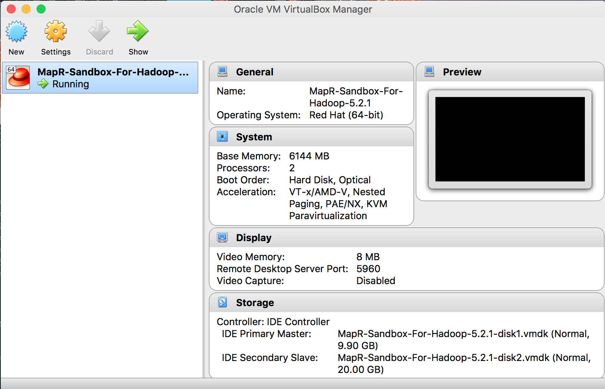
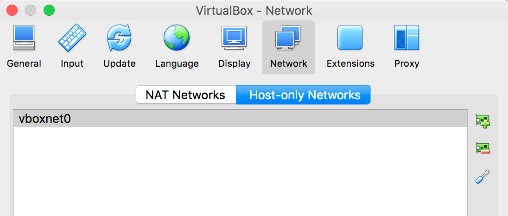
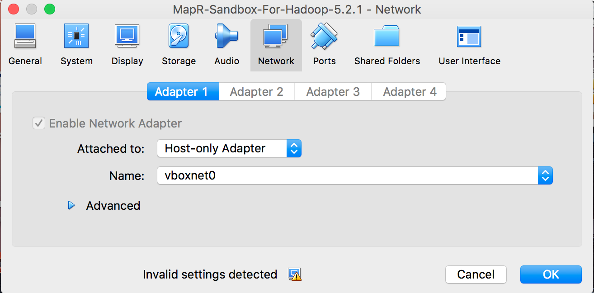

MapR Setup
==========

Setup development environment with **MapR Sandbox** and **MapR PACC** client container on a singe development machine.

### MapR Cluster
1. Install Oracle **VirtualBox**
2. Setup *Host-only* Network
3. Start *MapR-Sandbox-For-Hadoop-5.2.1.ova* [image](https://mapr.com/products/mapr-sandbox-hadoop/download/)
 
### MapR PACC
1. Install **Docker for Mac**
2. Build *maprtech/pacc* based docker image with your app Jar.
3. Find the IP address of Sandbox running in VirtualBox (Hint: *ifconfig* in Sandbox terminal)
4. Use this IP as **MAPR_CLDB_HOSTS** environment variable and start *maprtech/pacc* based container

### Screenshots

